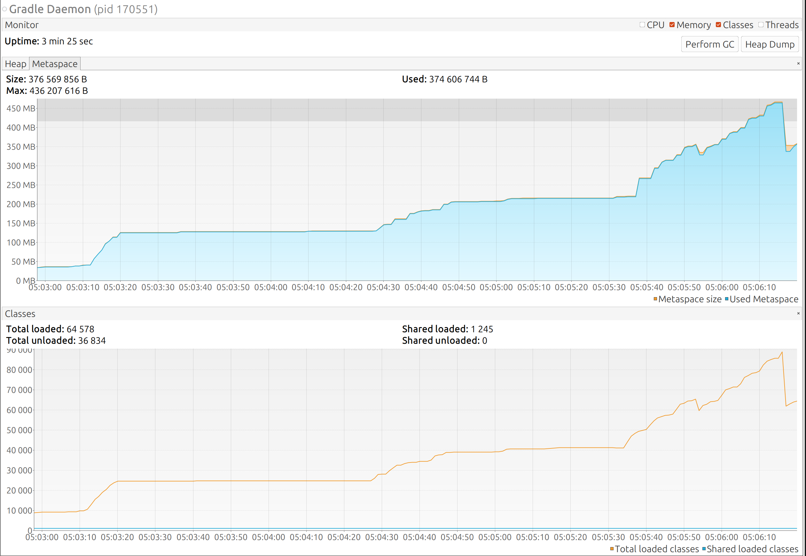
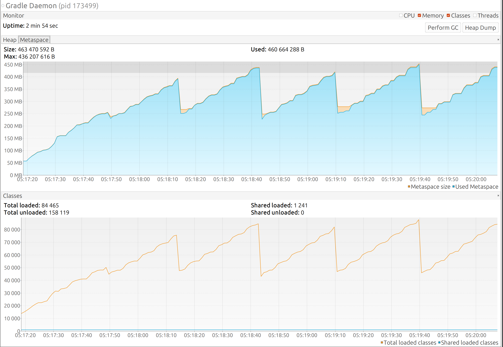

# Gradle Performance Monitoring bug

Sample project to demonstrate a case when Gradle Performance Monitoring might kill the Gradle Daemon
 too early due to full metaspace.

https://github.com/gradle/gradle/issues/15988

This is a parameterized Junit5 test with `GradleRunner` running build of the same project many times.

For some unknown reason, when Version Catalog is used in the project under test, each invocation of the 
 build increases metaspace usage in the Gradle Daemon by several megabytes.

Multiple project re-builds quickly bring metaspace usage to the limit with most of the metaspace may be garbage collected. 

## Testing

Run `./gradlew functionalTest` and watch the metaspace used by the Gradle Daemon, which is launched at the first
test and reused in the next tests. This daemon will be restarted by the Gradle GC monitoring service as soon
as metaspace usage reaches the limit.

Next, add `-Dorg.gradle.daemon.performance.enable-monitoring=false` to jvmargs of the test to disable the 
performance monitoring (uncomment [plugin/build.gradle.kts#38](plugin/build.gradle.kts#L38)) and run `./gradlew functionalTest` again. 

The entire test suite will pass using just one daemon. Metaspace will be garbage collected.

Metaspace usage with performance monitoring (daemon restarted after 7 tests):

Metaspace with performance monitoring disabled:

